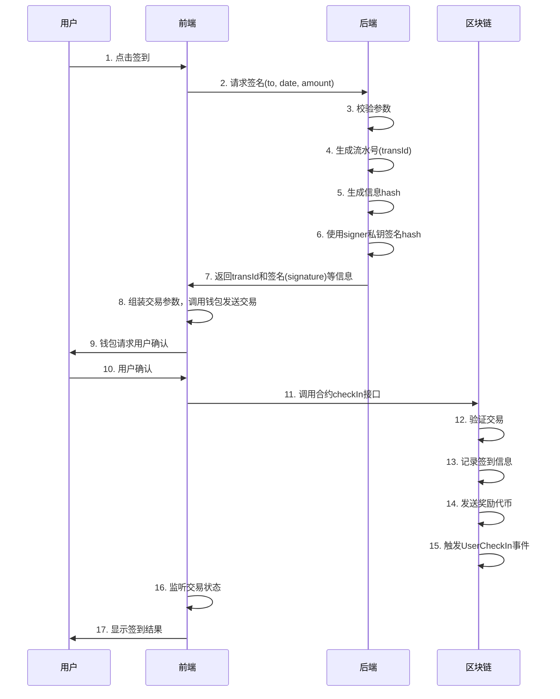
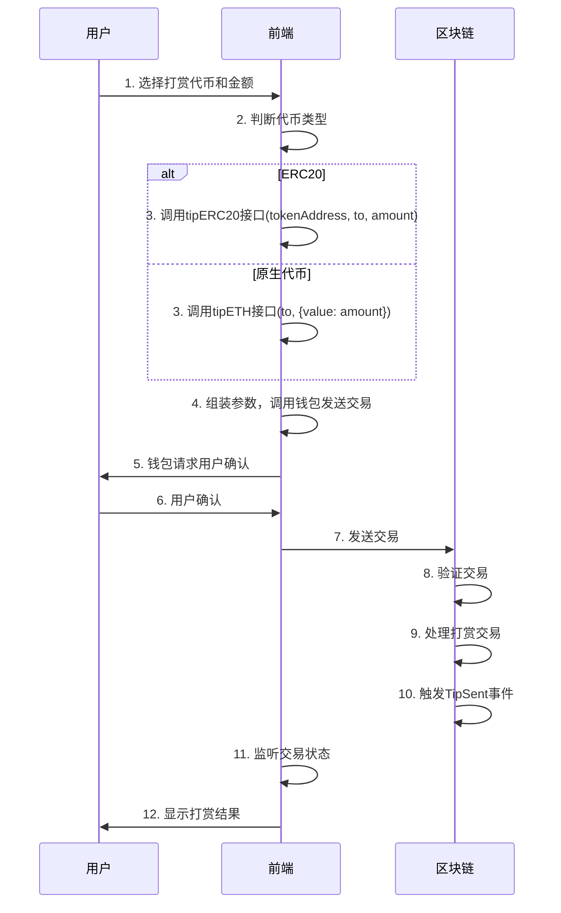

# V3EX 合约集成文档

## linea sepolia rpc
| 字段| 值|
| ------------ | ------------------------------------------------------------ |
| 网络名称     | Linea Sepolia                                                |
| RPC URL      | https://linea-sepolia.infura.io/v3/9aa3d95b3bc440fa88ea12eaa4456161 |
| 链ID         | 59141                                                        |
| 符号         | ETH                                                          |
| 区块链浏览器 | https://sepolia.lineascan.build                              |

## 相关合约地址

| 合约        | 地址 |
| ----------- | ---- |
| V3EXToken   |   0xE29FA1eda90338064A1C181fD9821734922B268e   |
| V3EXCheckIn |   0xB25aF23E325cB921E21776e5f87FFed8E4133053   |

## 合约接口文档
[IV3EXToken接口文档](./IV3EXToken接口文档.md)
[IV3EXCheckIn接口文档](./IV3EXCheckIn接口文档.md)

## 核心流程
### 每日签到

#### 步骤详细说明

1. **点击签到**：用户在页面点击签到按钮。
2. **请求签名**：前端将签到者钱包地址(`to`)、日期(`date`)和奖励金额(`amount`)发送给后端，请求签名。
3. **校验参数**：后端校验前端传来的参数。
4. **生成流水号**：后端生成一个唯一性的流水号 (`transId`)。
5. **生成信息hash**：后端使用 `keccak256(abi.encodePacked(chainId, code, transId, amount, to))` 方式生成hash。其中chainId为合约所在链的链Id, code为操作码(签到对应: CHECKIN)
6. **使用signer私钥签名hash**：后端使用签名者私钥对hash进行签名，得到签名信息( `signature`)。
7. **返回transId和签名等信息**：后端将流水号( `transId`) 和签名信息( `signature` )返回给前端。
8. **组装交易参数，调用钱包发送交易**：前端组装交易参数，并调用用户钱包发送交易请求。
9. **钱包请求用户确认**：前端钱包请求用户确认交易。
10. **用户确认**：用户确认交易。
11. **调用合约checkIn接口**：钱包将`date`, `amount`, `transId`, `signature` 发送到区块链调用合约的 `checkIn` 接口。
12. **验证交易**：区块链验证交易的合法性。
13. **记录签到信息**：区块链记录签到信息。
14. **发送奖励代币**：区块链合约发送奖励代币给用户。
15. **触发UserCheckIn事件**：合约触发 `UserCheckIn` 事件。
16. **监听交易状态**：前端监听交易状态。
17. **显示签到结果**：前端展示签到成功信息。

### 打赏

### 步骤详细说明

1. **选择打赏代币和金额**：用户选择要打赏的代币类型（ERC20或原生代币）和打赏金额。
2. **判断代币类型**：前端判断用户选择的代币类型。
3. **打赏接口选择**
   - 如果是ERC20代币，前端准备调用合约的 `tipERC20` 接口。
   - 如果是原生代币，前端准备调用合约的 `tipETH` 接口，并附带金额。
4. **组装参数，调用钱包发送交易**：前端组装交易参数，调用用户钱包发送交易请求。
5. **钱包请求用户确认**：前端钱包请求用户确认交易。
6. **用户确认**：用户确认交易。
7. **发送交易**：前端将交易发送到区块链。
8. **验证交易**：区块链验证打赏交易的合法性。
9. **处理打赏交易**：区块链处理打赏交易，将代币或原生代币转账给接收者。
10. **触发TipSent事件**：合约触发 `TipSent` 事件。
11. **监听交易状态**：前端监听交易状态。
12. **显示打赏结果**：前端展示打赏成功信息，并显示交易详情。
